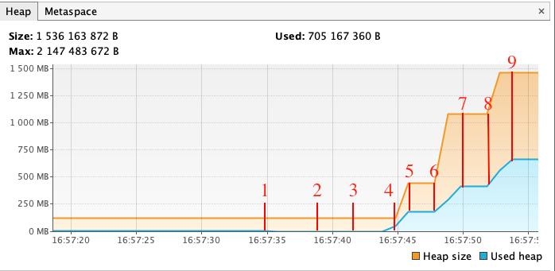
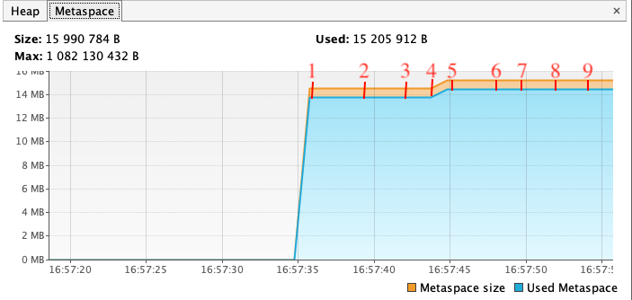
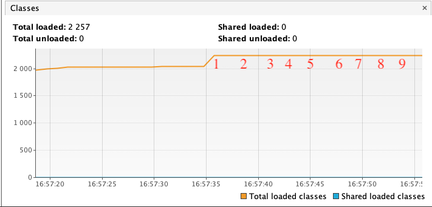

# Исследование JVM через VisualVM
## Heap:

###
1. **16:57:35** Начало загрузки io.vertx. Размер памяти heap состовляет 134МВ. Используется памяти в heap 6,5МВ.
1. **16:57:38** Начало загрузки io.netty. Размер памяти heap состовляет 134МВ. Используется памяти в heap 6,5МВ.
1. **16:57:41** Начало загрузки org.springframework. Размер памяти heap состовляет 134МВ. Используется памяти в heap 7,5МВ.
1. **16:57:44** Создание 5000000 объектов. Размер памяти heap состовляет 134МВ. Используется памяти в heap 57МВ.
1. **16:57:45** Создано 5000000 объектов. Размер памяти heap состовляет 468МВ. Используется памяти в heap 193МВ.
1. **16:57:48** Созданание 5000000 объектов. Размер памяти heap состовляет 468МВ. Используется памяти в heap 193МВ.
1. **16:57:49** Создано 5000000 объектов. Размер памяти heap состовляет 1140МВ. Используется памяти в heap 313МВ.
1. **16:57:52** Создание 5000000 объектов. Размер памяти heap состовляет 1140МВ. Используется памяти в heap 440МВ.
1. **16:57:53** Создано 5000000 объектов. Размер памяти heap состовляет 1536МВ. Используется памяти в heap 594МВ.
###
## Metaspace:

###
1. **16:57:35** Начало загрузки io.vertx. Размер памяти metaspace состовляет 15,3МВ. Используется памяти в metaspace 14,5МВ.
1. **16:57:38** Начало загрузки io.netty. Размер памяти metaspace состовляет 15,3МВ. Используется памяти в metaspace 14,5МВ.
1. **16:57:41** Начало загрузки org.springframework. Размер памяти metaspace состовляет 15,3МВ. Используется памяти в metaspace 14,5МВ.
1. **16:57:44** Создание 5000000 объектов. Размер памяти metaspace состовляет 15,9МВ. Используется памяти в metaspace 15,1МВ.
1. **16:57:45** Создано 5000000 объектов. Размер памяти metaspace состовляет 15,9МВ. Используется памяти в metaspace 15,1МВ.
1. **16:57:48** Созданание 5000000 объектов. Размер памяти metaspace состовляет 15,9МВ. Используется памяти в metaspace 15,1МВ.
1. **16:57:49** Создано 5000000 объектов. Размер памяти metaspace состовляет 15,9МВ. Используется памяти в metaspace 15,1МВ.
1. **16:57:52** Создание 5000000 объектов. Размер памяти metaspace состовляет 15,9МВ. Используется памяти в metaspace 15,2МВ.
1. **16:57:53** Создано 5000000 объектов. Размер памяти metaspace состовляет 15,9МВ. Используется памяти в metaspace 15,2МВ.
###
## Classes:

###
1. **16:57:35** Начало загрузки io.vertx. Было загружено classes 2256.
1. **16:57:38** Начало загрузки io.netty. Было загружено classes 2256. 
1. **16:57:41** Начало загрузки org.springframework. Было загружено classes 2256.
1. **16:57:44** Создание 5000000 объектов. Было загружено classes 2257.
1. **16:57:45** Создано 5000000 объектов. Было загружено classes 2257.
1. **16:57:48** Созданание 5000000 объектов. Было загружено classes 2257.
1. **16:57:49** Создано 5000000 объектов. Было загружено classes 2257.
1. **16:57:52** Создание 5000000 объектов. Было загружено classes 2257.
1. **16:57:53** Создано 5000000 объектов. Было загружено classes 2257.
